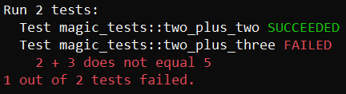

# Unit Tests
Simple unit test framework for C++.

Call RunAllTests() function in main.

Use UNIT_TEST( test_category, test_name ) macro for single unit test.

Use Assert( condition_check, "description on failure" ) function inside the unit test to check given condition.
